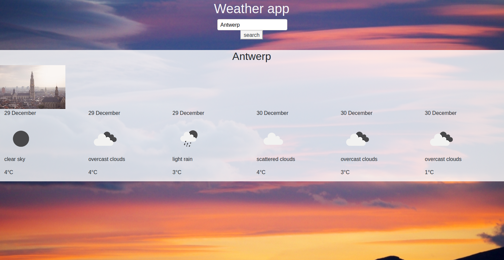
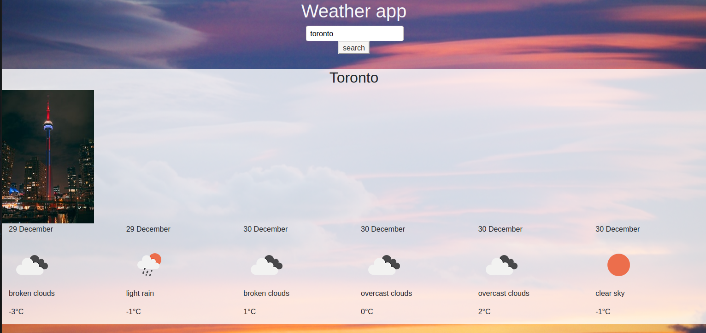

# ajax-weather-api

This is an exercise made for the becode course.

Exercise
Sprint 1 DONE

    create an account on this platform
    You are going to have to generate a key.
    create a home page where you ask the visitor to enter the city of his choice.

Sprint 2

    Get the weather data using axios or another javascript AJAX enabled library or use the native JS fetch() method |Done
    Optional: Use a cdn link to link axios to your project.
    Display the weather for the next 5 days. Show the averages per day. |done
    Apply styling to your project using media queries to make it responsive. |done

Extra challenges

    Use the API of https://unsplash.com/ to show a photo of the city they entered in the form. |done
    Use a graph library like Google Graphs to show a line graph of the temperature over time.

<h2>How to use this API </h2>
To use this api, you will need to make an account at https://home.openweathermap.org/.
Then obtain a key. Use that key to replace the WeatherKey.

### Example pictures

  

